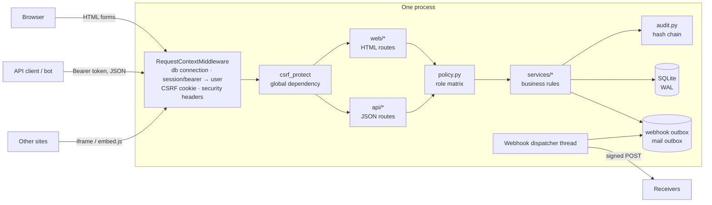

# Architecture

Doggfather is a single Python process serving server-rendered HTML and a
JSON API from the same service layer, over one SQLite file. That is the whole
deployment. This document explains why, and where things live.

## Goals that drove the design

1. **Adoptable on Monday.** `docker compose up` on a laptop with the network
   off: no external database, no CDN, no auth provider, no mail service.
2. **Isolation that cannot be painted on.** Every authorization decision is
   made in the backend, in one module, before data is read.
3. **Correctness over breadth.** Invariants live in the schema where
   possible; every feature ships with tests through the real HTTP stack.
4. **Readable by a stranger.** Boring, explicit code: plain SQL, plain Jinja2,
   no build step.

## Stack

| Layer | Choice | Why |
|---|---|---|
| Runtime | Python 3.12 | Readable, and the statistics (normalization, Bradley–Terry) read like the maths. |
| Web | FastAPI on Starlette, served by Uvicorn | Typed request models, dependency-injected guards, OpenAPI for free. |
| Views | Jinja2, server-rendered, autoescaped | Fast pages, no client framework, works without JS. JS is progressive enhancement only. |
| Storage | SQLite via the standard library, WAL | One file, zero ops, transactional, fast enough for ~12 events a year of this size by orders of magnitude. |
| Crypto | stdlib `hashlib.scrypt`, `hmac`; `cryptography` for Ed25519 | Nothing homemade except composition. |
| Packaging | Multi-stage Dockerfile, non-root, healthcheck | Wheels are resolved at build time; the runtime image never touches PyPI. |

Five runtime dependencies in total (`requirements.txt`).

## Components



### Request lifecycle

1. **`middleware.py`** (plain ASGI, so it wraps streaming bodies too) opens
   one SQLite connection per request. It resolves `Authorization: Bearer`
   (API tokens; cookies are then ignored) or the `session` cookie into
   `request.state.user`, ensures a CSRF cookie, and adds CSP, `nosniff`,
   `Referrer-Policy` and frame denial (except `/embed/*`).
2. **`csrf.py`** is a *global* FastAPI dependency, so no route can be added
   without it. Form posts must echo the double-submit token. JSON is allowed
   because it cannot be sent cross-site without a CORS preflight this server
   never grants. Any present `Origin` must match. Bearer requests are exempt.
3. **Routes** (`web/` for HTML, `api/` for JSON) parse input and call **policy**
   and **services**. They hold no business rules.
4. **`policy.py`** holds the role matrix (who sees whose scores, tracks,
   aggregates). The same functions guard HTML and API.
5. **`services/`** enforce the rules (deadlines, team caps, rubric ranges,
   quadratic budgets), write in explicit transactions (`db.transaction`,
   nesting as savepoints), and append audit entries. Services raise domain
   errors (`errors.py`); the app maps them to JSON or to a styled page with the
   same status code.

### Module map

```
src/doggfather/
  app.py            factory, exception mapping, lifespan (webhook worker)
  config.py         DOGFOOD_* settings        clock.py   injectable UTC clock
  db.py             connections, transactions, migrations
  middleware.py     per-request context + headers
  csrf.py           CSRF guard                security.py  hashing, tokens, HMAC signing
  auth.py           accounts, sessions        policy.py    authorization matrix
  audit.py          hash-chained audit log + plain-English sentences
  ratelimit.py      sliding-window limiter    seed.py      fixtures + demo logins
  services/         events teams projects uploads gallery rubric judges assignment scoring
                    normalization pairwise comparisons results progress exports bundles voting
                    comments duplicates webhooks tokens signing records mailer
  web/              HTML routes, one module per area
  api/              judging (checker contract), organizer (progress, CSV), v1 (REST)
  templates/ static/ migrations/ tools/
```

## Security architecture (summary; full analysis in THREAT-MODEL.md)

- **Sessions:** 256-bit random tokens, stored as SHA-256, HttpOnly, SameSite=Lax,
  sliding expiry, rotated at login, revoked by password reset.
- **Passwords:** scrypt with per-hash salt, constant-time comparison, equal
  timing for unknown emails, rate-limited login and reset.
- **Isolation:** judge-scoped queries filter on `judge_id` in SQL. Peer and
  unknown judge ids both get 403, so there is no enumeration oracle.
- **Deadline:** one guard on every submission write path, server clock only,
  refusals audited.
- **Uploads:** typed by magic bytes, SVG refused, 2 MB cap, random names,
  served with `nosniff` and a sandboxing CSP.
- **Output:** Jinja2 autoescaping everywhere, http(s)-only links (validated on
  input and filtered on output), CSV formula neutralisation.
- **Integrity:** append-only, hash-chained audit log; immutable Ed25519-signed
  records; quadratic budgets and score ranges enforced by triggers.

## Offline-first decisions

| Usually done with | Here |
|---|---|
| Web fonts from a CDN | System font stacks that pick up Archivo Black and JetBrains Mono when installed |
| Swagger UI from a CDN | `/api/docs` rendered server-side from the live OpenAPI document |
| An email provider | `outbox` table, readable by admins (optional SMTP via env) |
| An auth provider | Local accounts, sessions and tokens |
| A job queue | A daemon thread draining a transactional outbox table |

## Configuration

All environment variables are prefixed `DOGFOOD_`:

| Variable | Default | Meaning |
|---|---|---|
| `DATA_DIR` | `data` (`/data` in Docker) | Database, uploads, signing key, secret |
| `DEMO` | `0` (`1` in compose) | Seed demo passwords and the fixed checker sessions |
| `BASE_URL` | `http://localhost:8080` | Absolute links in mail, embeds, certificates |
| `FIXTURES_PATH` | `fixtures.json` | Seeded into an empty database at boot |
| `SECRET_KEY` | generated into `DATA_DIR/secret.key` | HMAC key for cookies and pseudonyms |
| `COOKIE_SECURE` | `0` | Set `1` behind HTTPS |
| `SESSION_DAYS` | `14` | Session lifetime |
| `MAX_UPLOAD_BYTES` | `2097152` | Image size cap |
| `SMTP_HOST`, `SMTP_PORT`, `SMTP_USER`, `SMTP_PASSWORD`, `MAIL_FROM` | unset | Optional real mail delivery |
| `WEBHOOK_BLOCK_PRIVATE` | `0` | Refuse webhook targets on private and loopback networks |
| `WEBHOOK_WORKER` | `1` | Run the delivery thread |
| `HOST`, `PORT` | `0.0.0.0`, `8080` | Bind address |

Compose also reads `DOGFOOD_PORT` for the host port.

## Trade-offs and limits

- **Single process.** The rate limiter keeps its state in memory and the
  webhook worker is a thread, so run one process (the default). Scaling out
  would need a shared limiter (Redis) and a single elected worker.
  Throughput on one process is far above what a 40-project hackathon needs.
- **SQLite has a single writer.** Writes are short transactions (`BEGIN
  IMMEDIATE`, with a 10 s busy timeout). Judging 30 projects × 30 judges is
  under a thousand writes over a week.
- **Server-rendered UI.** No offline PWA and no real-time push (the dashboard
  polls every 15 s). That is a deliberate simplicity trade.
- **Normalization corrects judge location, not spread.** See JUDGING.md;
  the z-score and Bradley–Terry views cover spread for comparison.

## Testing

`pytest` runs 210 tests in about 30 s, through the real HTTP stack
(`fastapi.testclient`) against a database seeded from the official
fixtures. Each test gets its own copy of a once-seeded template database.

- `test_contract.py` boots uvicorn and runs the **unmodified official
  `run.py`** against it.
- Isolation, deadline, voting, integrity, API, webhooks, records, bundles,
  normalization (including the planted-bias simulation) and pairwise each
  have their own module.
- `test_api.py` fails if `docs/openapi.json` drifts from the running app.

`scripts/offline-acceptance.sh` reproduces `acceptance-report.txt` inside a
container started with `--network none`.

## Ideas worth stealing

- **The same service call behind HTML and JSON**, so UI and API cannot
  diverge on permissions or validation.
- **Invariants as triggers**: score ranges, quadratic budgets, the append-only
  audit log and immutable signed records hold even against a buggy code path.
- **Judge records that commit to scores** (a hash in the signed payload)
  without disclosing them, revealable later.
- **An assigner that optimises for normalizability**, not only load:
  overlap diversity keeps the judge graph connected.
