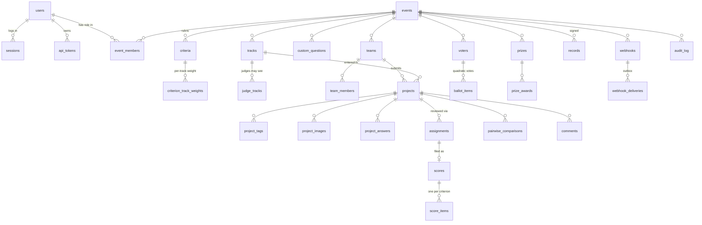

# Data model

One SQLite file (`<DOGFOOD_DATA_DIR>/doggfather.db`, WAL mode) holds all the
state. The schema is plain SQL in [`src/doggfather/migrations/`](src/doggfather/migrations/),
applied in order at boot and recorded in `schema_migrations`. There is no ORM:
every query is visible SQL, and invariants that must hold on *every* write
path are constraints and triggers, not only application code.

## Conventions

- **Ids are opaque text.** Imported ids are kept verbatim (`evt_01`, `prj_07`,
  `jdg_26`); new rows get prefixed random ids (`prj_3f9a1c2b7e`). Nothing
  parses meaning out of an id. Keeping bundle ids is what makes export,
  re-import and diff work.
- **Timestamps are ISO 8601 UTC text** with second precision
  (`2026-03-01T18:00:00Z`). Lexical order is chronological order, so `CHECK`
  constraints and indexes compare them directly. All time comes from one
  injectable clock, so tests freeze it on either side of a deadline.
- **Roles are per event.** `event_members(event_id, user_id, role)` with role
  organizer, judge or participant; one person can judge one hackathon and
  compete in the next. `users.is_admin` is the only global role. A visitor is
  simply "no session".

## Entities



### Identity (`001_init`, `004_platform`)

| Table | Purpose | Notes |
|---|---|---|
| `users` | People | `email` unique, case-insensitive. `password_hash` NULL = account exists (imported judge, team member) but was never claimed; claiming goes through a password reset. scrypt `n=2^14, r=8, p=1`. |
| `sessions` | Server-side sessions | Only `sha256(token)` is stored; a stolen database yields no usable session. Sliding expiry; deleted on logout, on reset, or with "sign out others". |
| `password_resets` | One-time reset links | Hashed, 2-hour expiry, single use. |
| `api_tokens` | Personal REST tokens | Hashed; `prefix` for recognition in the UI; revocable. |

### Events (`001`, `002_public`, `006_pairwise`)

| Table | Purpose | Notes |
|---|---|---|
| `events` | A hackathon | Phase boundaries with `CHECK (open < close ≤ judging_close)` and `CHECK (voting_open < voting_close)`. Voting mode and credits, normalization method, `results_published_at`, `pairwise_enabled`. |
| `event_members` | Per-event roles | PK `(event_id, user_id, role)`. A trigger refuses judge + participant in the same event (conflict of interest). |
| `tracks` | Tracks | `UNIQUE (event_id, name)` and `UNIQUE (id, event_id)`, the latter so children can hold composite keys. |
| `prizes` | Overall or per-track prizes | `(track_id, event_id)` composite FK: a prize's track must be in its event. |
| `custom_questions` | Organizer-defined submission fields | kind: text, textarea, url, choice (`options` JSON). |

### Teams and submissions (`001`, `003_integrity`)

| Table | Purpose | Notes |
|---|---|---|
| `teams` | Teams | Names are **not unique**: the fixtures have three "StillTrail" teams. `invite_code` unique, rotatable. |
| `team_members` | Membership | `UNIQUE (event_id, user_id)`: one team per person per event. `(team_id, event_id)` composite FK so the event cannot disagree with the team's. |
| `projects` | Submissions | status draft, submitted or withdrawn; `CHECK (status <> 'submitted' OR submitted_at IS NOT NULL)`. `(track_id, event_id)` composite FK. Duplicate flag fields (`duplicate_of`, `duplicate_reason`, `duplicate_dismissed_at`) and `withdrawn_reason`. |
| `project_tags`, `project_images`, `project_answers` | The rest of the standard field set | Images store random 128-bit file names under `<data>/uploads/`. |

The deadline itself is not a schema constraint. It depends on "now", which
SQLite cannot know, so it lives in one service guard (`assert_submissions_open`)
that every write path calls.

### Judging (`001`, `006`)

| Table | Purpose | Notes |
|---|---|---|
| `criteria` | Rubric | `UNIQUE (event_id, key)`, `CHECK (min < max)`, `weight ≥ 0`. |
| `criterion_track_weights` | Per-track weight overrides | Absent row = inherit the event weight. |
| `judge_tracks` | What a judge may see | The isolation joins go through this table. |
| `assignments` | Judge × project | `UNIQUE (judge_id, project_id)`, a `batch` label, status pending or done. |
| `scores` | One scorecard | `UNIQUE (assignment_id)` and `UNIQUE (judge_id, project_id)`. |
| `score_items` | One value per criterion | **Triggers reject values outside the criterion's range**, on insert and update. |
| `pairwise_comparisons` | Direct A-vs-B verdicts | Unique expression index on `(judge, min(a,b), max(a,b))`: each pair once per judge. |

Scores are stored **raw**. Weighted totals and normalized scores are
computed on read (`services/results.py`), so re-weighting or switching the
normalization method never rewrites data, and every published number can be
recomputed from stored scorecards.

### Public (`002_public`)

| Table | Purpose | Notes |
|---|---|---|
| `voters` | Ballot holders | One per account, verified email or device per event (three partial-uniqueness constraints). `ip_hash` and `ua_hash` are keyed hashes, never raw addresses. `flagged`, `voided_at`. |
| `ballot_items` | Votes per project | `CHECK (votes BETWEEN 1 AND 100)`. **Triggers enforce Σ votes² ≤ the event's credits.** |
| `vote_codes` | Email one-time codes | Hashed, 15-minute expiry, attempt counter. |
| `comments` | Public comments | Length checked in schema; hidden, never deleted. |

### Accountability and platform (`001`, `004`, `005_records`)

| Table | Purpose | Notes |
|---|---|---|
| `audit_log` | Append-only trail | **UPDATE and DELETE are refused by triggers.** Each row stores `hash = sha256(prev_hash + canonical_json(row))`; `verify_chain()` pinpoints the first altered row. |
| `records` | Signed certificates and judge records | Canonical JSON plus an Ed25519 signature. A trigger forbids changing payload or signature; only revocation fields change. One *live* record per subject (partial unique index). |
| `prize_awards` | Prize winners | |
| `webhooks`, `webhook_deliveries` | Outgoing events | Deliveries are a transactional outbox written in the same transaction as the change they announce. |
| `invites`, `outbox`, `meta` | Judge invitations, local mail, seed marker | |

## Import and export

### The bundle format

A **bundle** is JSON in a superset of the DOGFOOD `fixtures.json` shape. The
fixtures file is a valid bundle, and so is every export.

```jsonc
{
  "format": "doggfather.bundle", "version": 1,          // optional
  "event": { "id", "name", "submissions_close",          // required
             "slug", "tagline", "description", "submissions_open", "judging_close",
             "max_team_size", "review_target", "normalization", "results_published_at",
             "voting_mode", "voting_open", "voting_close", "vote_credits", "pairwise_enabled" },
  "tracks":      [{ "id", "name", "description" }],
  "prizes":      [{ "id", "name", "value", "description", "track" }],
  "questions":   [{ "id", "prompt", "help", "kind", "options", "required" }],
  "criteria":    [{ "key", "label", "description", "weight", "min", "max", "track_weights": { "<track>": w } }],
  "organizers":  [{ "email", "name" }],
  "judges":      [{ "id", "name", "email", "tracks": ["<track>"] }],
  "teams":       [{ "id", "name", "members": ["email", …] }],
  "projects":    [{ "id", "team", "track", "title", "summary"|"tagline", "description",
                    "repo_url", "demo_url", "video_url", "tags", "status", "submitted_at" }],
  "scores":      [{ "judge", "project", "criteria": { "<key>": n }, "comment", "submitted_at", "batch" }],
  "assignments": [{ "judge", "project", "batch" }],   // pending work
  "comparisons": [{ "judge", "winner", "loser", "created_at" }]
}
```

How the fixture file maps:

| Fixture field | Stored as |
|---|---|
| `event.submissions_close` | `events.submissions_close_at`, **exactly**, so the portal is closed on boot as the checker expects. Missing dates default to open = close − 72h and judging close = close + 10d (the seed opens judging and voting relative to boot for the demo). |
| `judges[]` | `users` (fixture id kept) + `event_members(judge)` + `judge_tracks` |
| `teams[].members` (emails) | `users` matched by email, created password-less if new + `team_members` (first listed = captain) + `event_members(participant)` |
| `projects[].summary` | `tagline` and, when there is no description, `description` |
| `scores[]` | a completed `assignment` (batch "imported") + `scores` + `score_items`; the rubric is derived from the criteria keys when the bundle has no `criteria` |

Import runs in **one transaction**: a malformed bundle (missing event, a
project for an unknown team, a score on an undefined criterion) leaves
nothing behind. People are matched by email, so importing a second event
reuses existing accounts. Non-http links are dropped with a warning.

### Pathways

| Direction | Web | API | CLI |
|---|---|---|---|
| Import a bundle | Organize → "Import an event" (upload) | `POST /api/v1/bundles` | `python -m doggfather import bundle.json` |
| Export a bundle | Organizer → Exports → "Download bundle" | `GET /api/v1/events/{id}/bundle` | `python -m doggfather export evt_01 out.json` |
| CSV (7 kinds) | Organizer → Exports | `GET /api/events/{id}/export/{kind}.csv` | via the API |

`tests/test_bundles.py` proves the round trip is lossless: export the fixture
event, import it into an empty portal, export again, and every section is
identical.

**Deliberately excluded from bundles:** password hashes, sessions, API
tokens, voter identities and comments. They belong to people, not to the
event archive. Community tallies are available as CSV.

## Backups and operations

- Backup: `sqlite3 doggfather.db ".backup backup.db"` (safe while running,
  WAL-aware) plus the `uploads/` and `keys/` directories. The volume in
  `docker-compose.yml` holds all three.
- Keep `keys/ed25519.pem`: losing it means new records get a new `key_id`.
  Old records still verify against the old public key if you kept it.
- Migrations run automatically at boot and are idempotent
  (`python -m doggfather migrate` runs them explicitly).
- Moving to Postgres would mean porting six migration files (the SQL is
  standard apart from `INSERT OR IGNORE` and triggers) and the connection
  layer in `db.py`. Services contain no SQLite-specific logic beyond that.
